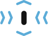

# Scrollmotion



A JavaScript library for screen-intersected animations on page scroll.

* Simple and lightweight. Only ~1KB (gzipped).
* Written in TypeScript. Compiled to ES6.
* Native JavaScript. No jQuery required.
* Animations based on [Animate.css](https://animate.style).
* Integrated support for custom functions.

Check out the [demo page](https://scrollmotion.neoflow.ch/demo.html) to see the library in action.

## Requirements
Any browser which fully supports ES6, [IntersectionObserver](https://caniuse.com/#search=intersectionobserver) and
 [MutationObserver](https://caniuse.com/#feat=mutationobserver).

**Please note** Internet Explorer 11 and older is not supported.

## Installation
You have 2 options to install the library.

Via npm...
```bash
npm install @neoflow/scrollmotion
```
...or manually download the latest release from [here](https://github.com/Neoflow/Scrollmotion/releases/).

## Usage
1\.  Link the CSS-file of [Animate.css](https://animate.style).
```html
<link rel="stylesheet" href="your/path/to/animate.min.css"/>
```

2\. Link the JavaScript-file of the library and add an initial JavaScript-code to start it.
```html
<script src="your/path/to/scrollmotion.min.js"></script>
<script>
    const sm = Scrollmotion('.sm-item');
    sm.start();
</script>
```

3\. Add ```sm-item``` as CSS class and one of the CSS classes from [Animate.css](https://animate.style) as data attribute
```data-sm-animate-class``` to each website component you want to get animated, when it got intersected on page scroll. 
```html
<div class="sm-item" data-sm-animate-class="animate__backInLeft">
    <!-- your content -->
</div>
```

4\. Scroll on your website and enjoy the animations. 

## Configuration
The library is configurable on initialization with two arguments.

```javascript
const selector = '.sm-item'; // Your custom selector
const sm = new Scrollmotion('.sm-item', {
   // Your custom options
});
```
The 1st argument is a selector for the website components you want to get observed and animated (Default:`.sm-item`). 
The 2nd argument is an object literal for the options described below (Default:`{}`).

| Key | Type | Description | Default                                                                                    | 
|---|---|---|--------------------------------------------------------------------------------------------|
| `root` | Element | Root element for the intersection observer. [Read more](https://developer.mozilla.org/en-US/docs/Web/API/IntersectionObserver/root). | `null`                                                                                     |
| `rootMargin` | string | Bounding box of the root element. [Read more](https://developer.mozilla.org/en-US/docs/Web/API/IntersectionObserver/rootMargin). | `'0px 0px 0px 0px'`                                                                        |
| `threshold` | number[] | Threshold to report visibility changes to the observer. [Read more](https://developer.mozilla.org/en-US/docs/Web/API/IntersectionObserver/thresholds). | `[0, 0.25, 0.5, 0.75, 1]`                                                                  |
| `ratio` | number | Ratio how much an observed item has actually been visible before the animation performs. | `0`                                                                                        |
| `observeMutation` | boolean | Set `true` to enable MutationObserver and get new items observed and animated too. | `false`                                                                                    |
| `animateClass` | string | Default CSS class of [Animate.css](https://animate.style) for the animation. | `animate__swing`                                                                           |
| `initialized` | (container, items) => void | Event callback, when the library is initialized. | `null`                                                                                     |
| `started` | () => void | Event callback, when the library has started. | `null`                                                                                     |
| `itemAnimated` | (item) => void | Event callback, when an item got animated. | `null`                                                                                     |
| `stopped` | () => void | Event callback, when the the library has stopped. | `null`                                                                                     |
| `prepareItem` | (item) => void | Function for preparing the observable items for animation. | [See code](https://github.com/Neoflow/Scrollmotion/blob/master/src/default/options.ts#L12) |
| `animateItem` | (item) => void | Function for animating the intersected item. | [See code](https://github.com/Neoflow/Scrollmotion/blob/master/src/default/options.ts#L15) |

**Please note** If you overwrite the default functions of `prepareItem` or `animateItem`, the handling of 
the animations with [Animate.css](https://animate.style) is not supported anymore.

## Advanced configuration
The options `animateClass` and `ratio` can also be set as data attributes for each website component, 
which will overwrite the options set on initialization of the library.

```html
<div class="sm-item" data-sm-animate-class="animate__backInRight" data-sm-ratio="0.5">
    <!-- your content -->
</div>
```

The data attribute `data-sm-ratio` can be used for `ratio` and `data-sm-animate-class` overwrites `animateClass`.

## Contributors
* Jonathan Nessier, [Neoflow](https://www.neoflow.ch)

If you would like to see this library develop further, or if you want to support me or show me your appreciation, please
 donate any amount through PayPal. Thank you! :beers:
 
[](https://www.paypal.me/JonathanNessier)

## License
Licensed under [MIT](LICENSE). 

*Made in Switzerland with :cheese: and :heart:*